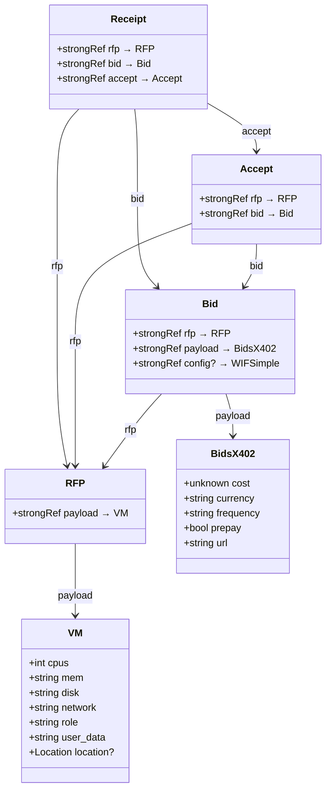
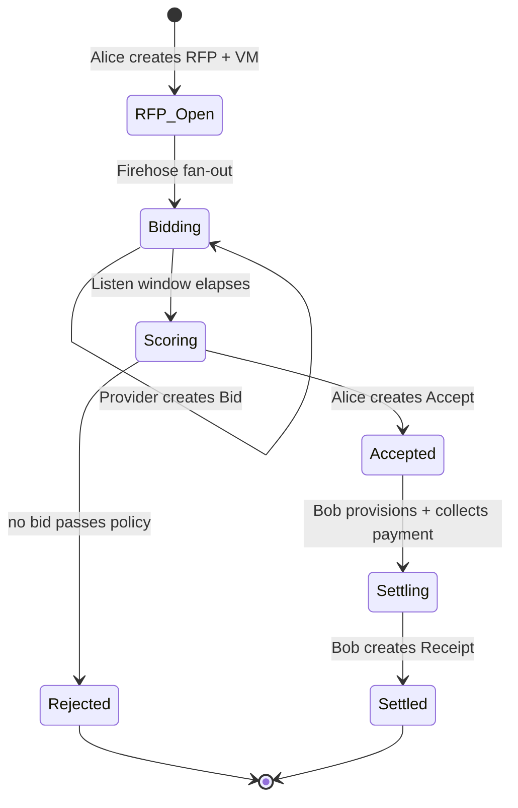
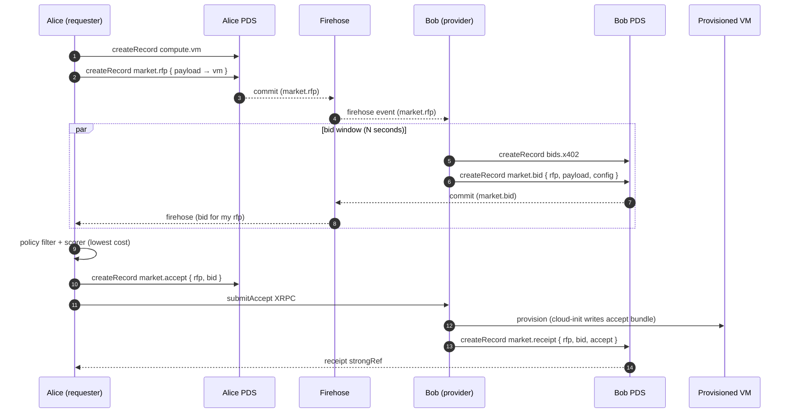

# Compute Contracts - Alpha

Both operators scan the QR codes from their own processes using the
did-key-associator webapp at `https://qr.fedfork.com`.

```bash
git clone --recursive https://github.com/publicdomainrelay/org-root-dispatcher-typescript
cd org-root-dispatcher-typescript
```

**Terminal 1 — Bidder:**

> Bids on compute contracts

```bash
cd atproto-market
deno run -A hono-bidder/mod.ts \
  --compute-provider-local \
  --policy-mode tangled-vouch \
  --serve-port 0 \
  --no-ingress-proxy \
  --firehose-mode subscriberepos
```

**Terminal 2 — Requester:**

> Wants compute

```bash
cd atproto-market
deno run -A request-vm-ssh/mod.ts \
  --atproto-oauth-qr \
  --atproto-handle alice.bsky.social \
  --policy-mode tangled-vouch \
  --no-ingress-proxy \
  --firehose-mode subscriberepos
```

## Step-by-step records (YAML — on wire these are JSON in ATProto repos)

**1. Alice publishes the VM spec (payload of the RFP)**

```yaml
$type: com.publicdomainrelay.temp.compute.vm
cpus: 2
mem: 4G
disk: 40G
network: 500G
role: my-cool-role
user_data: |
  #cloud-config
  runcmd:
    - [sh, -c, "echo hello > /var/log/hi"]
location:
  country: USA
  region: west
```

**2. Alice publishes the RFP envelope**

```yaml
$type: com.publicdomainrelay.temp.market.rfp
payload:
  $type: com.atproto.repo.strongRef
  uri: at://did:plc:alice/com.publicdomainrelay.temp.compute.vm/3mm3dolfolz2c
  cid: bafyrei...vm
```

**3. Bob publishes the x402 pricing payload**

```yaml
$type: com.publicdomainrelay.temp.market.bids.x402
cost: 0.10
currency: USDC
frequency: hourly
prepay: true
url: https://compute-contract.bob.example/receipt
```

**4. Bob publishes the bid envelope**

```yaml
$type: com.publicdomainrelay.temp.market.bid
rfp:
  $type: com.atproto.repo.strongRef
  uri: at://did:plc:alice/com.publicdomainrelay.temp.market.rfp/3mm3doliee72s
  cid: bafyrei...rfp
payload:
  $type: com.atproto.repo.strongRef
  uri: at://did:plc:bob/com.publicdomainrelay.temp.market.bids.x402/3mm4...
  cid: bafyrei...x402
```

**5. Alice publishes the Accept**

```yaml
$type: com.publicdomainrelay.temp.market.accept
rfp:
  $type: com.atproto.repo.strongRef
  uri: at://did:plc:alice/com.publicdomainrelay.temp.market.rfp/3mm3doliee72s
  cid: bafyrei...rfp
bid:
  $type: com.atproto.repo.strongRef
  uri: at://did:plc:bob/com.publicdomainrelay.temp.market.bid/3mm4...
  cid: bafyrei...bid
```

**6. Bob publishes the Receipt**

```yaml
$type: com.publicdomainrelay.temp.market.receipt
rfp:
  $type: com.atproto.repo.strongRef
  uri: at://did:plc:alice/com.publicdomainrelay.temp.market.rfp/3mm3doliee72s
  cid: bafyrei...rfp
bid:
  $type: com.atproto.repo.strongRef
  uri: at://did:plc:bob/com.publicdomainrelay.temp.market.bid/3mm4...
  cid: bafyrei...bid
accept:
  $type: com.atproto.repo.strongRef
  uri: at://did:plc:alice/com.publicdomainrelay.temp.market.accept/3mlagijgoeb23
  cid: bafyrei...accept
```

### Actors

| Actor | Role |
|-------|------|
| Alice (Requester) | Authors the **RFP** and later the **Accept**. Wants compute. |
| Bob (Provider/Bidder) | Authors **Bids** and the **Receipt**. Has spare machines. |
| Relay | WebSocket dispatcher + AT Protocol firehose proxy. Routes tunnels, indexes collections. |
| PDS | Each actor's AT Protocol Personal Data Server holding their signed records. |
| Firehose | `com.atproto.sync.subscribeRepos` / Jetstream — public commit stream carrying everything. |

### RFP Compute Marketplace (the spine)

All cross-record references use `com.atproto.repo.strongRef` (`{$type, uri, cid}`),
so the chain is content-addressed end-to-end. Every record is signed (badge.blue
inline attestations + remote proof CID binding).

### Record graph



### State machine



### End-to-end sequence



### Authority and validation rules

- `Accept.rfp.uri` MUST equal `Bid.rfp.uri` (and CIDs must match) — provider relay refuses to settle otherwise.
- `Accept` MUST be authored by the same DID that authored the referenced RFP.
- `Receipt` MUST be authored by the same DID that authored the referenced Bid.
- All records carry badge.blue inline attestations. Receipts additionally carry a remote proof CID binding accept → receipt.

### Settlement flow

Two settlement modes, both content-addressed with attestation chains:

**Free settlement** — zero-cost compute. Requester creates `accepts.free` record, GETs bidder's `/free/receipt/{uri}/{cid}`. Bidder mints `receipts.free` with remote proof CID binding accept→receipt. Verification: `verifyFreeGrant` checks NSID, author DID, and CID binding.

**X402 settlement** — HTTP 402 Payment Required. Requester creates signed `accepts.x402` record, GETs bidder's payment URL. Bidder validates payment, returns `receipts.x402`. Optional `paymentMiddleware` for payment processing.

Both paths produce a signed `market.receipt` record with:
- `rfp`, `bid`, `accept` strongRefs (full contract chain)
- `cid` — attestation CID binding accept→receipt (DAG-CBOR + SHA-256 → CIDv1)
- `signatures` — badge.blue inline attestations by the receipt author

### Event flow (VM lifecycle)

Events are `market.event` records submitted via `submitEvent` XRPC. Each event strongRefs the receipt it pertains to and carries a domain-specific payload:

| Event | Payload NSID | Trigger | Handler |
|-------|-------------|---------|---------|
| `vm.started` | `compute.events.vm.started` | VM/container boots | `{ createdAt }` |
| `vm.onNetwork` | `compute.events.vm.onNetwork` | Guest gets IP | `{ address?, createdAt }` |
| `vm.delete` | `compute.events.vm.delete` | Requester done | `{ reason, createdAt }` — bidder destroys VM |

**vm.delete flow:**
1. Requester creates signed `compute.events.vm.delete` record
2. Wraps in signed `market.event` with receipt strongRef
3. `submitEvent` XRPC to bidder's `pdr_temp_compute_event` endpoint
4. Bidder validates: receipt exists in `activeContracts`, `issuerDid` matches accept author
5. Bidder calls `computeProvider.destroy(providerId)` — kills container/deletes droplet
6. Fires `onContractChange({ type: "terminated" })`, removes from `activeContracts`

Events are submitted in background (`eventBackground: true`) — bidder responds 200 immediately, processes async. Only the accept author can submit events against their receipt.

---

## Quick Start

### Prerequisites

```bash
# macOS
container system start

# Linux
sudo systemctl start docker
```

### 1. Run a bidder (provides compute)

```bash
# Desktop tray app (macOS)
cd deno-macos-runner-desktop && ./rebuild.sh

# Headless (cross-platform) — local container mode
cd atproto-market
deno run -A hono-bidder/mod.ts \
  --accept-scope only_me \
  --private-key-hex-path ~/Documents/bidder-private-key.hex \
  --pds-state-path ~/Documents/bidder-pds-state.db \
  --compute-provider-local

# With explicit container mode
deno run -A hono-bidder/mod.ts \
  --accept-scope only_me \
  --private-key-hex-path ~/Documents/bidder-private-key.hex \
  --pds-state-path ~/Documents/bidder-pds-state.db \
  --compute-provider-local \
  --compute-provider-local-container-mode container
```

### 2. Request a VM

```bash
cd atproto-market
deno run -A request-vm-ssh/mod.ts \
  --policy-mode only_me \
  --bid-window-sec 3 \
  --private-key-hex-path ~/Documents/requester-private-key.hex \
  --pds-state-path ~/Documents/requester-pds-state.db \
  --exec "echo hello && uname -a"
```

This posts a `compute.vm` record + signed `market.rfp`, collects bids,
picks the winner, provisions the guest via cloud-init, and SSHs in through
the websocket relay tunnel.

### 2b. Run with direct_network (multi-operator trust)

`direct_network` accepts RFPs from DIDs in the operator's vouch graph. Requires
two operators who have mutually vouched for each other via `sh.tangled.graph.vouch`.

**Setup (one-time):** Both operators scan the QR codes from each other's processes
using the did-key-associator webapp at `https://qr.fedfork.com`.

**Terminal 1 — Bidder (aliceoa):**
```bash
cd atproto-market
deno run -A hono-bidder/mod.ts \
  --accept-scope direct_network \
  --private-key-hex-path ~/Documents/bidder-aliceoa-private-key.hex \
  --pds-state-path ~/Documents/bidder-aliceoa-pds-state.db \
  --compute-provider-local
```

**Terminal 2 — Requester (johnandersen777):**
```bash
cd atproto-market
deno run -A request-vm-ssh/mod.ts \
  --policy-mode direct_network \
  --bid-window-sec 30 \
  --private-key-hex-path ~/Documents/requester-private-key.hex \
  --pds-state-path ~/Documents/requester-pds-state.db
```

**Trust chain:** requester (`qnlb2vbn...`) → requester_associate badgeBlueKeys
keyId=`5svqtrhheairglgiiyvutzik` (john) → aliceoa vouches for john via
`sh.tangled.graph.vouch` → bidder operator (`lpfuqerea3...`, aliceoa).

**Verification:** bidder logs `scope check: matched requester association via operator`,
requester logs `bids_collected count:1`, `compute_request_complete receiptOk:true`.

### 3. Run everything locally (single process)

```bash
cd atproto-market
deno run --allow-all compute-contract-full-flow/run_full_flow.ts
```

Starts dispatcher, fake PLC, bidder, requester — drives full RFP→bid→accept→provision→SSH in one process.

### 4. SSH directly (no re-provision)

```
ssh -o ProxyCommand='websocat --binary wss://<vmName>--<flat-did>.fedproxy.com' root@<vmName>--<flat-did>.fedproxy.com
```

---

## All Repos

| # | Repo | GitHub | Packages | Role |
|---|------|--------|----------|------|
| 1 | `atproto-market/` | `publicdomainrelay/atproto-market` | 48 | Market engine: RFP, bid, accept, requester, bidder, gateway, policy, settlement |
| 2 | `hono-compute-provider/` | `publicdomainrelay/compute-provider-digitalocean` | 16 | Compute provisioning: local containers, QEMU VMs, DigitalOcean droplets, OIDC, RBAC |
| 3 | `did-key-ingress-proxy/` | `publicdomainrelay/did-key-ingress-proxy` | 11 | WebSocket relay: dispatcher, tunnel, subscriber, SNI subdomain routing |
| 4 | `typescript-helpers/` | `publicdomainrelay/typescript-helpers` | 14 | Cross-repo shared: logger, serve, CLI args, firehose watchers, hostname helpers |
| 5 | `hono-pds/` | `publicdomainrelay/hono-pds` | 4 | AT Protocol PDS: repo storage, MST, CBOR, CARv1, accounts, firehose |
| 6 | `deno-worker-sandbox/` | `publicdomainrelay/deno-hono-sandbox` | 10 | Deno Worker sandbox: ephemeral compute, manifest store, instance runner |
| 7 | `deno-macos-runner-desktop/` | `publicdomainrelay/deno-macos-runner-desktop` | 16 | Desktop tray bidder: OAuth, device keys, badge blue keys, secret stores |
| 8 | `atproto-relay/` | `publicdomainrelay/atproto-relay` | 5 | Collection-indexing firehose relay: requestCrawl, listReposByCollection, subscribeRepos |
| 9 | `hono-jsr/` | `publicdomainrelay/hono-package-registry` | 6 | JSR-compatible package registry: local FS, remote git, composite stores |
| 10 | `open-architecture/` | `publicdomainrelay/open-architecture` | 8 | Docs-as-code: Alice stubs, STATUS_REPORT, COMPUTE_CONTRACT_FLOW_MAP |
| 11 | `compute-contract/` | `publicdomainrelay/compute-contract` | — | Lexicon schemas: compute.vm, market.rfp/bid/accept/receipt |
| 12 | `compute-spa/` | `publicdomainrelay/org-root-dispatcher-typescript` | — | Browser SPA: request-vm-page, fedproxy relay client |
| 13 | `compute-contract-full-flow/` | same as #12 | — | Single-process e2e integration test |
| 14 | `did-key-associator/` | `publicdomainrelay/did-key-associator` | — | QR code DID association webapp |
| 15 | `atproto-reverse-proxy/` | `publicdomainrelay/atproto-reverse-proxy` | — | Go Caddy reverse proxy (fedproxy TLS termination) |

---

## Infrastructure Services

These run independently, providing the backbone for the market.

### Dispatcher (did-key-ingress-proxy)

```bash
cd did-key-ingress-proxy
deno run -A hono-did-key-ingress-proxy/mod.ts \
  --hostname localhost --port 5555
```
Options: `--hostname` (default xrpc.fedproxy.com), `--port` (default 8080), `--relay-timeout-ms` (30000), `--nonce-ttl-ms` (60000), `--additional-hosts`, `--unix-socket`.

### PDS (AT Protocol Personal Data Server)

```bash
cd hono-pds
deno run -A main.ts --port 2583

# With persisted identity + did:web services
deno run -A main.ts \
  --port 2583 \
  --private-key-hex <64-char-hex> \
  --public-hostname pds.example.com \
  --crawlers "https://reg.market.fedfork.com" \
  --did-web-services '[{"id":"pdr_temp_market","type":"PDRTempMarket"}]'
```
Options: `--port` (2583), `--hostname` (127.0.0.1), `--private-key-hex`, `--did-web-services` (JSON), `--public-hostname`, `--crawlers`.

### Market Relay (atproto-relay)

```bash
cd atproto-relay
deno run -A hono-atproto-relay/mod.ts --port 2584

# Local dev (patches fetch+WS for *.localhost → dispatcher)
deno run -A hono-atproto-relay/mod.ts \
  --port 2584 --local-dev-relay-port 5555
```
Options: `--port` (2584), `--hostname` (127.0.0.1), `--local-dev-relay-port`.
Serves: `requestCrawl`, `listReposByCollection`, `subscribeRepos`.

### JSR Package Registry

```bash
cd hono-jsr
deno run -A hono-package-registry/main.ts --port 5556

# Serve polyrepo packages to guest containers
deno run -A hono-package-registry/main.ts \
  --store local --base-dir .. --port 5556 --no-passthrough
```
Options: `--store` (local/git), `--base-dir` (./packages), `--git-url`, `--port` (8080), `--passthrough`/`--no-passthrough`, `--fallback-version` (0.0.0).

---

## Full Local Dev Stack (6 terminals)

```
T1: dispatcher  →  did-key-ingress-proxy/hono-did-key-ingress-proxy --hostname localhost --port 5555
T2: relay       →  atproto-relay/hono-atproto-relay --port 2584 --local-dev-relay-port 5555
T3: PDS         →  hono-pds main.ts --port 2583
T4: JSR         →  hono-jsr hono-package-registry/main.ts --base-dir .. --port 5556 --no-passthrough
T5: bidder      →  atproto-market/hono-bidder --compute-provider-local --relay-dispatcher-host localhost:5555
T6: requester   →  atproto-market/request-vm-ssh --dispatcher-host localhost:5555 --bid-window-sec 3
```

Or one process: `deno run --allow-all atproto-market/compute-contract-full-flow/run_full_flow.ts`

---

## All CLI Commands

### Requester (`request-vm-ssh`)

```bash
cd atproto-market

# Minimal
deno run -A request-vm-ssh/mod.ts --policy-mode only_me --bid-window-sec 3

# Full
deno run -A request-vm-ssh/mod.ts \
  --policy-mode only_me \
  --bid-window-sec 10 \
  --private-key-hex-path ~/Documents/requester-private-key.hex \
  --pds-state-path ~/Documents/requester-pds-state.db \
  --exec "hostname; echo PASS; id -un" \
  --keep-vm

# Skip SSH (testing only)
deno run -A request-vm-ssh/mod.ts --skip-ssh --keep-vm --bid-window-sec 3
```

### Bidder (`hono-bidder`)

```bash
cd atproto-market

# Minimal local
deno run -A hono-bidder/mod.ts \
  --compute-provider-local \
  --accept-scope only_me

# Production (DO + firehose)
deno run -A hono-bidder/mod.ts \
  --relay-dispatcher-host xrpc.fedproxy.com \
  --plc-directory-url https://plc.directory \
  --compute-provider-local \
  --compute-provider-local-container-mode container \
  --compute-provider-deno-worker \
  --worker-permission-mode allow-net \
  --rfp-firehose-mode jetstream \
  --rfp-firehose-url wss://jetstream.example.com/subscribe \
  --serve-port 0 \
  --offering-refresh-sec 300
```

### Gateway (`hono-compute-contract-gateway`)

```bash
cd atproto-market
deno run -A hono-compute-contract-gateway/mod.ts \
  --port 2585 \
  --dispatcher-host xrpc.fedproxy.com \
  --fedproxy-host fedproxy.com
```

### Policy Engine (`hono-policy`)

```bash
cd atproto-market
deno run -A hono-policy/mod.ts --port 2586 --policy allow-net

# Strict auth mode
deno run -A hono-policy/mod.ts --port 2586 --policy "allow-net,deny-all" --strict-auth
```

### Compute Provider (standalone)

```bash
cd hono-compute-provider
deno run -A hono-compute-provider/mod.ts --provider local --port 8080

# DigitalOcean mode
DO_TOKEN=xxx deno run -A hono-compute-provider/mod.ts --provider digitalocean
```

### QEMU Standalone

```bash
cd hono-compute-provider
# Build VM image
deno run -A hono-qemu-standalone/mod.ts --subcommand build --distro ubuntu

# Run VM
deno run -A hono-qemu-standalone/mod.ts --subcommand run --distro ubuntu \
  --user-data-file ./cloud-init.yaml
```

### PDS

```bash
cd hono-pds
deno run -A main.ts --port 2583
```

### JSR Registry

```bash
cd hono-jsr
deno run -A hono-package-registry/main.ts --port 8080
```

### Dispatcher

```bash
cd did-key-ingress-proxy
deno run -A hono-did-key-ingress-proxy/mod.ts --hostname localhost --port 5555
```

### Market Relay

```bash
cd atproto-relay
deno run -A hono-atproto-relay/mod.ts --port 2584
```

### PLC Directory

```bash
cd atproto-market
deno run -A hono-plc/mod.ts --port 2587 --hostname 0.0.0.0
```
Options: `--port` (2587), `--hostname` (127.0.0.1). Env vars: `PORT`, `HOSTNAME`. Serves `did:plc` directory — POST to register, GET to resolve. In-memory store (ephemeral).

### Desktop Bidder (macOS tray)

```bash
cd deno-macos-runner-desktop

# Build .app bundle
./rebuild.sh
# or directly:
deno desktop --no-check --allow-all hono-macos-runner-desktop/mod.ts

# Override config
CONFIG_PATH_HONO_MACOS_RUNNER_DESKTOP=/path/to/config.json \
  deno desktop --no-check --allow-all hono-macos-runner-desktop/mod.ts

# Log tail:
tail -n 9999999 -F /tmp/deno-macos-runner-desktop.log | jq -rR --unbuffered '(fromjson? // .)'
```
Uses `deno desktop` (not `deno run` — requires Deno Desktop runtime for `Deno.BrowserWindow`, `Deno.Tray`, `Deno.TrayPanel`).
Options: `--service-name`, `--storage-dir`, `--state-path`, `--oauth-client-id`, `--oauth-redirect-uri`, `--dispatcher-host` (xrpc.fedproxy.com), `--plc-directory-url`, `--firehose-url`, `--offering-refresh-sec` (300), `--skip-market`.

### Desktop Bidder (cross-platform web UI)

```bash
cd deno-macos-runner-desktop
deno run -A hono-desktop/mod.ts \
  --port 8080 \
  --dispatcher-host xrpc.fedproxy.com \
  --storage-dir ~/Documents/bidder-state
```
Options: `--port` (0), `--hostname` (0.0.0.0), `--storage-dir`, `--state-path`, `--oauth-client-id`, `--oauth-redirect-uri`, `--dispatcher-host`, `--plc-directory-url`, `--offering-refresh-sec` (300), `--skip-market`, `--start-bidder`, `--private-key-hex`. Env vars: `PORT`, `HOSTNAME`, `SERVICE_NAME`, `STORAGE_DIR`, `STATE_PATH`, `OAUTH_CLIENT_ID`, `OAUTH_REDIRECT_URI`, `RELAY_INGRESS_PROXY_HOST`, `PLC_DIRECTORY_URL`, `FIREHOSE_URL`, `OFFERING_REFRESH_SEC`, `SKIP_MARKET`.

### Relay Subscriber Client

```bash
cd did-key-ingress-proxy
deno run -A hono-did-key-ingress-proxy-subscriber/mod.ts \
  --dispatcher-host xrpc.fedproxy.com \
  --atproto-handle user.bsky.social \
  --atproto-password xxxx
```
Options: `--dispatcher-host`, `--atproto-pds` (https://bsky.social), `--atproto-handle`, `--atproto-password`, `--save-keypair`, `--load-keypair`, `--keypair-path` (./keypair.json), `--write-proxy-ref-http-to-path`.

### Tunnel Client (SSH ProxyCommand)

```bash
cd did-key-ingress-proxy

# As SSH ProxyCommand
ssh -o ProxyCommand='deno run -A hono-did-key-ingress-proxy-tunnel/mod.ts \
  --dispatcher-host xrpc.fedproxy.com --subdomain <sub>' root@vm

# Direct tunnel
deno run -A hono-did-key-ingress-proxy-tunnel/mod.ts \
  --dispatcher-host xrpc.fedproxy.com --subdomain <subdomain>
```
No `cli-args-env.json` — raw `Deno.args` parsing. Options: `--dispatcher-host` (required), `--subdomain` (required). Pipes stdin/stdout through relay WebSocket to guest sshd.

### Tunnel Subscriber (in-VM agent)

```bash
cd did-key-ingress-proxy

# Run inside VM — bridges relay tunnel to local sshd
deno run -A hono-did-key-ingress-proxy-tunnel-subscriber/mod.ts \
  --dispatcher-host xrpc.fedproxy.com \
  --aud-host xrpc.fedproxy.com \
  --private-key-hex <64-char-hex> \
  --target-host 127.0.0.1 --target-port 22

# Compiled binary (for VM image)
deno compile -A hono-did-key-ingress-proxy-tunnel-subscriber/mod.ts
./tunnel-subscriber --dispatcher-host <host> --aud-host <host> --private-key-hex <hex>
```
No `cli-args-env.json` — raw `Deno.args` parsing. Options: `--dispatcher-host` (required), `--aud-host` (required), `--private-key-hex` (required), `--target-host` (127.0.0.1), `--target-port` (22). Typically deployed via cloud-init `buildTunnelUserData()` as a systemd service, not run manually.

### Deno Worker Sandbox

```bash
cd deno-worker-sandbox

# Ephemeral sandbox (execute code in isolated worker)
deno run -A hono-sandbox/mod.ts --port 2584

# Compute XRPC server (manifest store + instance runner)
deno run -A hono-compute-deno/mod.ts \
  --port 2585 \
  --permission-mode deny-all \
  --attestation-key-path ./attestation-key.jwk
```
Sandbox options: `--port` (2584), `--hostname` (127.0.0.1), `--timeout-ms`. Env vars: `PORT`, `HOSTNAME`, `SANDBOX_TIMEOUT_MS`.
Compute-deno options: `--port` (2585), `--hostname` (127.0.0.1), `--unix-socket`, `--pds-url`, `--atproto-handle`, `--atproto-password`, `--attestation-key-path`, `--timeout-ms`, `--permission-mode` (deny-all), `--policy-handler-built-in`, `--relay`, `--relay-dispatcher-host`. Env vars: `PORT`, `HOSTNAME`, `UNIX_SOCKET`, `PDS_URL`, `ATPROTO_HANDLE`, `ATPROTO_PASSWORD`, `ATTESTATION_KEY_PATH`, `COMPUTE_DENO_TIMEOUT_MS`, `PERMISSION_MODE`, `POLICY_HANDLER_BUILT_IN`, `RELAY`, `RELAY_INGRESS_PROXY_HOST`.

### Static File Server

```bash
cd typescript-helpers

# Serve current directory
deno run -A hono-http-static/mod.ts --port 8080 --serve-path .

# Custom path
deno run -A hono-http-static/mod.ts --port 8081 --serve-path /var/www
```
Options: `--port` (8080), `--serve-path` (.), `--log-level` (info). Env vars: `PORT`, `SERVE_PATH`, `MIN_LOG_LEVEL`.

---

## Testing

### All tests across polyrepo

```bash
deno run -A scripts/test-all.ts
```

### Per-repo test tasks

```bash
cd atproto-market
deno test --allow-all test/bidder_container_integration_test.ts
deno test --allow-all test/gateway_request_vm_integration_test.ts
deno test --allow-all test/policy_remote_test.ts

cd hono-compute-provider
deno task test:all

cd hono-pds && deno task test
cd deno-worker-sandbox && deno task test
cd typescript-helpers && deno task test
cd hono-jsr && deno task test
```

### Prod tests (conditional — probes real infra)

```bash
DENO_TEST_PROD=1 deno test --allow-all atproto-market/test/bidder_prod_integration_test.ts
```

---

## Container Management

```bash
# macOS container runtime
container system start
container logs -f $(container list --format json | jq -r 'sort_by(.configuration.creationDate) | last | .id')
container kill $(container list -qa); container rm $(container list -qa)

# Docker
docker system start
docker kill $(docker ps -qa); docker rm $(docker ps -qa)
```

---

## Codegraph

Single index at org root: 1,208 files, 16,307 nodes, 46,838 edges.

```bash
# Full architecture walk
codegraph explore "whatAliceIs theInfiniteLoop puttingItTogether"

# Requester flow
codegraph explore "runComputeContract createRequesterPDS discoverBiddersFromRelay"

# Bidder + provisioning
codegraph explore "createMarketBidder createVmBidderCallbacks provisionLocal runContainer"

# Relay tunnel
codegraph explore "createIngress createSubscriber startTunnel tunnelOverRelay"

# Attestation
codegraph explore "verifyRecordSignatures verifyRemoteProof createAttestationCid"

# Firehose discovery
codegraph explore "discoverBiddersFromRelay offering refresh listReposByCollection"
```

---

## Package Discovery & Git

```bash
# List all packages
./scripts/find-all-package.ts | python3 -c "import sys,json; [print(p['name'], p['path']) for p in json.load(sys.stdin)]"

# Git status across all repos
deno run -A scripts/poly-repo-status-report.ts

# Commit and push across all repos
deno run -A scripts/commit-and-push-all.ts

# Fake embeddings server (needed by test-all.ts)
deno run -A scripts/fake-embeddings-server.ts

# Update submodules
deno run -A scripts/submodules-to-main.ts
```

---

## Deploy (production)

```bash
# Deploy all services
deno run -A scripts/install-prod.ts

# Individual deploys
cd atproto-reverse-proxy && bash scripts/deploy.sh       # fedproxy
cd compute-spa && bash scripts/deploy.sh                  # SPA
cd did-key-associator && bash scripts/deploy.sh           # QR associator
cd deno-macos-runner-desktop && bash scripts/deploy.sh    # Tray app
```

---

## Releases

Prebuilt binaries and SPA bundles from every push to `main`. Two release tracks:

### `latest` — 14 binaries × 3 platforms + 2 SPAs (44 assets)

Every binary is built for **Linux x86_64**, **Windows x86_64**, and **macOS ARM64**.
Names use the pattern `<name>-<platform>` (`.exe` appended on Windows).

```bash
# Download a specific binary for your platform
curl -fsSLo request-vm-ssh \
  https://github.com/publicdomainrelay/org-root-dispatcher-typescript/releases/latest/download/request-vm-ssh-linux-x64
curl -fsSLo request-vm-ssh.exe \
  https://github.com/publicdomainrelay/org-root-dispatcher-typescript/releases/latest/download/request-vm-ssh-windows-x64.exe
curl -fsSLo request-vm-ssh \
  https://github.com/publicdomainrelay/org-root-dispatcher-typescript/releases/latest/download/request-vm-ssh-macos-arm64
chmod +x request-vm-ssh
./request-vm-ssh --help

# Download SPAs
curl -fsSLo compute-spa.tar.gz \
  https://github.com/publicdomainrelay/org-root-dispatcher-typescript/releases/latest/download/compute-spa.tar.gz
curl -fsSLo did-key-associator.tar.gz \
  https://github.com/publicdomainrelay/org-root-dispatcher-typescript/releases/latest/download/did-key-associator.tar.gz

# List all 44 assets
gh release view latest --repo publicdomainrelay/org-root-dispatcher-typescript
```

| Binary | Linux | Windows | macOS | Use |
|--------|-------|---------|-------|-----|
| `request-vm-ssh` | `*-linux-x64` | `*-windows-x64.exe` | `*-macos-arm64` | Requester CLI — posts RFP, collects bids, SSHs into VM |
| `hono-bidder` | `*-linux-x64` | `*-windows-x64.exe` | `*-macos-arm64` | Bidder CLI — provides compute, responds to RFPs |
| `compute-contract-gateway` | `*-linux-x64` | `*-windows-x64.exe` | `*-macos-arm64` | Gateway HTTP API |
| `hono-policy` | `*-linux-x64` | `*-windows-x64.exe` | `*-macos-arm64` | Policy engine |
| `hono-plc` | `*-linux-x64` | `*-windows-x64.exe` | `*-macos-arm64` | PLC directory — ephemeral did:plc |
| `hono-pds` | `*-linux-x64` | `*-windows-x64.exe` | `*-macos-arm64` | PDS — AT Protocol Personal Data Server |
| `hono-did-key-ingress-proxy` | `*-linux-x64` | `*-windows-x64.exe` | `*-macos-arm64` | Relay dispatcher |
| `hono-did-key-ingress-proxy-subscriber` | `*-linux-x64` | `*-windows-x64.exe` | `*-macos-arm64` | Relay subscriber |
| `tunnel-subscriber` | `*-linux-x64` | `*-windows-x64.exe` | `*-macos-arm64` | In-VM tunnel agent |
| `tunnel` | `*-linux-x64` | `*-windows-x64.exe` | `*-macos-arm64` | SSH ProxyCommand over relay |
| `hono-compute-provider` | `*-linux-x64` | `*-windows-x64.exe` | `*-macos-arm64` | Compute provider (local/DO) |
| `hono-compute-deno` | `*-linux-x64` | `*-windows-x64.exe` | `*-macos-arm64` | Deno worker XRPC server |
| `hono-sandbox` | `*-linux-x64` | `*-windows-x64.exe` | `*-macos-arm64` | Ephemeral sandbox |
| `hono-http-static` | `*-linux-x64` | `*-windows-x64.exe` | `*-macos-arm64` | Static file server |
| `compute-spa.tar.gz` | — | — | — | Browser SPA bundle |
| `did-key-associator.tar.gz` | — | — | — | DID Key Associator SPA bundle |

### `desktop-latest` — macOS tray app

```bash
# Download macOS .app bundle
curl -fsSLo macos-desktop.zip \
  https://github.com/publicdomainrelay/org-root-dispatcher-typescript/releases/download/desktop-latest/macos-desktop.zip
unzip macos-desktop.zip

# Cross-platform desktop CLI
curl -fsSLo hono-desktop \
  https://github.com/publicdomainrelay/org-root-dispatcher-typescript/releases/download/desktop-latest/hono-desktop
chmod +x hono-desktop
./hono-desktop --port 8080
```

| Asset | Platform | Use |
|-------|----------|-----|
| `macos-desktop.zip` | macOS (Apple Silicon) | Tray app: OAuth login, local bidder, container provisioning |
| `hono-desktop` | macOS binary | Cross-platform headless bidder server |
| `hono-desktop-linux` | Linux binary | Cross-platform headless bidder server |

### Using binaries

All binaries are self-contained Deno compiled executables. No runtime needed.

```bash
# Requester: request and SSH into a VM (replace <bidder-did>)
./request-vm-ssh --policy-mode only_me --bid-window-sec 3 \
  --exec "hostname && uname -a"

# Bidder: provide compute (requires container runtime)
./hono-bidder --compute-provider-local \
  --accept-scope only_me --serve-port 0

# PDS: run a personal data server
./hono-pds --port 2583

# Relay: run the dispatcher
./hono-did-key-ingress-proxy --hostname localhost --port 5555

# Tunnel: SSH through relay to a guest VM
ssh -o ProxyCommand='./tunnel --dispatcher-host xrpc.fedproxy.com --subdomain <sub>' root@vm

# SPA: serve locally with static file server
tar -xzf compute-spa.tar.gz
./hono-http-static --port 8080 --serve-path .
```

## Key Files

| File | Purpose |
|------|---------|
| `CLAUDE.md` | Project-wide coding standards (ABC layering, Deno+Hono+JSR patterns) |
| `open-architecture/COMPUTE_CONTRACT_FLOW_MAP.md` | Full architecture deep-dive (1454 lines) |
| `open-architecture/STATUS_REPORT.md` | Stub→implementation mapping |
| `open-architecture/open_architecture_today.md` | Alice's reasoning (the blueprint) |
| `compute-contract/lexicons/` | AT Protocol record schemas (22 record types, 8 XRPC ops) |
| `compute-contract/README.md` | RFP lifecycle spec with Mermaid diagrams, YAML examples, shell walkthrough |

## Architecture

Every capability split 4 ways (ABC layering):
- `lib/common/` — shared types, constants, pure helpers
- `lib/abc/` — interfaces + pure state, zero I/O
- `lib/<concept>-<transport>/` — implementation (timers, crypto, fetch, sockets)
- `lib/hono-factory-*/` — Hono integration (routes, middleware)
- `hono-*/` — thin CLI entrypoint

Deps flow one way: common → abc → impl → factory → CLI. No cycles.

See `CLAUDE.md` for the full layering rules and patterns.
