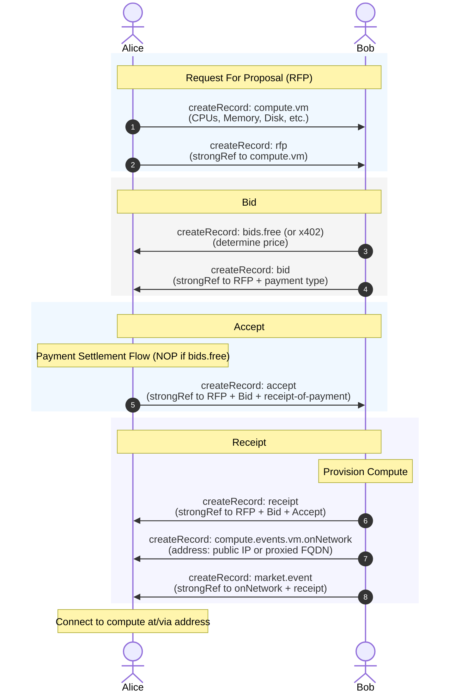

# Compute Contracts - Pre-Alpha

This is a spec for ATProto accounts to request and advertise (compute)
resources.

This spec is for you if you run an organization and want to leverage
decentralized identity to allow access to your org's compute (and in the future
more) resources to your members and their workloads/agents.

The flow is: Request For Proposal -> Bid -> Accept -> Receipt

## Quickstart

> [!TIP]
>
> If you want to quickly enable folks in your organization to be able to request
> compute using their ATProto accounts, or Workloads/Agents/DIDs associated with
> their ATProto account you can use https://digitalocean.socialweb.computer
>
> It's a hosted service that runs a bidder in the centralized cloud for you in
> case you don't want to run your own decentralized on on your own compute hosts
> to get started.

```bash
curl -fsSL https://deno.land/install.sh | sh

git clone --recursive https://github.com/publicdomainrelay/org-root-dispatcher-typescript
cd org-root-dispatcher-typescript/atproto-market
```

[](https://asciinema.org/a/1260738)

### Ephemeral Accounts with association records

#### Bid on compute contracts

```bash
deno run -A hono-bidder/mod.ts \
  --compute-provider-local \
  --policy-mode only-me
```

#### Request compute

```bash
deno run -A request-vm-ssh/mod.ts \
  --policy-mode only-me
```

## BlueSky Accounts via QR Code Session Transfer

Both operators scan the QR codes from their own processes using the
did-key-associator webapp at `https://qr.fedfork.com`.

#### Bids on compute contracts

```bash
deno run -A hono-bidder/mod.ts \
  --compute-provider-local \
  --policy-mode tangled-vouch \
  --serve-port 0 \
  --no-ingress-proxy \
  --firehose-mode subscriberepos
```

#### Request Compute

```bash
deno run -A request-vm-ssh/mod.ts \
  --atproto-oauth-qr \
  --atproto-handle alice.bsky.social \
  --policy-mode tangled-vouch \
  --no-ingress-proxy \
  --firehose-mode subscriberepos
```

## Protocol



- Alice, Bob, and Eve are on the network
- Alice wants to issue a Compute Contract Request For Proposal (CCRFP)
  - Alice's CCRFP will state she wants an OpenCode instance
- Bob has plenty of builder machines
- Eve wants to know what Alice is doing
- Alice has vouched for Bob
- Alice has denounced Eve
- Alice creates a CCRFP manifest (the VM-specific payload — cpus, mem, disk,
  cloud-init `user_data`, ...)
- Alice wraps her CCRFP in a top-level RFP record (`domain: "compute"`,
  `payload` is a strongRef to the CCRFP). The RFP is the domain-tagged envelope
  bidders and indexers route on; the CCRFP is the inner VM-specific record.
- Alice makes her RFP/CCRFP pair available to the network
- Bob and Eve each issue a Compute Contract Bid (CCB) against the CCRFP
- Alice's policy engine sees that she's denounced Eve and vouched for Bob
- Alice issues a Compute Contract Bid Accept (CCBA) against Bob's CCB.
- Alice issues a x402 payment to Bob per info provided in his CCB.
  - Using the CCBA AT URI and CID to the CCB's stated CCR endpoint.
- Bob issues a Compute Contract Receipt (CCR) over the CCRFP, CCB, and CCBA
  - The CCR references the CCRFP, the CCB, and the CCBA.
- Bob builds to the CCRFP manifest's spec

### Compute Contract Flow (High level)

The compute contract flow can be executed purely over the firehose/relays.
That's what we'll cover in this section. For more details see the
open-architecture repo's [`COMPUTE_CONTRACT_FLOW_MAP.md`](https://github.com/publicdomainrelay/open-architecture/blob/main/COMPUTE_CONTRACT_FLOW_MAP.md).

All `market.*` records use https://badge.blue signatures, not shown here for
brevity.

Alice createRecord's the type of compute she wants

```yaml
$type: com.publicdomainrelay.temp.compute.vm
cpus: 2
mem: 4G
disk: 40G
network: 500G
role: my-cool-role
user_data: |
  #cloud-config
  runcmd:
    - [sh, -c, "echo hello world"]
location:
  country: USA
  region: west
```

Alice createRecord's a Request For Proposal (**rfp**) `strongRef`erencing the
compute she wants.

```yaml
$type: com.publicdomainrelay.temp.market.rfp
payload:
  $type: com.atproto.repo.strongRef
  uri: at://did:plc:alice/com.publicdomainrelay.temp.compute.vm/3mm3dolfolz2c
  cid: bafyrei...vm
```

Bob decides what he wants Alice to pay for the compute and createRecord's the
payment type for his bid.

```yaml
$type: com.publicdomainrelay.temp.market.bids.free
# Can also do x402 but haven't tested this in a while:
# $type: com.publicdomainrelay.temp.market.bids.x402
# cost: 0.10
# currency: USDC
# frequency: hourly
# prepay: true
# url: https://compute-contract.bob.example/receipt
```

Bob createRecord's a Bid (**bid**) `strongRef`erencing the compute she
wants.

```yaml
$type: com.publicdomainrelay.temp.market.bid
rfp:
  $type: com.atproto.repo.strongRef
  uri: at://did:plc:alice/com.publicdomainrelay.temp.market.rfp/3mm3doliee72s
  cid: bafyrei...rfp
payload:
  $type: com.atproto.repo.strongRef
  uri: at://did:plc:bob/com.publicdomainrelay.temp.market.bids.x402/3mm4...
  cid: bafyrei...x402
```

Alice settles the payment and gets a payment receipt according to settlement
sub-flow. If `bids.free`, then that's a NOP.

> [!NOTE]
>
> Settlement subflow hasn't been tested in a while for x402 and these docs will
> be updated in the future once we re-test and validate. We're focusing on orgs
> who want to distribute compute to their members in an ATProto native way for
> free first.

Alice then createRecord's an Accept (**accept**) record which wraps her
proof-of-payment receipt (only if not `bids.free`)

```yaml
$type: com.publicdomainrelay.temp.market.accept
rfp:
  $type: com.atproto.repo.strongRef
  uri: at://did:plc:alice/com.publicdomainrelay.temp.market.rfp/3mm3doliee72s
  cid: bafyrei...rfp
bid:
  $type: com.atproto.repo.strongRef
  uri: at://did:plc:bob/com.publicdomainrelay.temp.market.bid/3mm4...
  cid: bafyrei...bid
```

Finally, Bob provisions the compute and issues a Receipt (**receipt**) when he
sees the Accept.

```yaml
$type: com.publicdomainrelay.temp.market.receipt
rfp:
  $type: com.atproto.repo.strongRef
  uri: at://did:plc:alice/com.publicdomainrelay.temp.market.rfp/3mm3doliee72s
  cid: bafyrei...rfp
bid:
  $type: com.atproto.repo.strongRef
  uri: at://did:plc:bob/com.publicdomainrelay.temp.market.bid/3mm4...
  cid: bafyrei...bid
accept:
  $type: com.atproto.repo.strongRef
  uri: at://did:plc:alice/com.publicdomainrelay.temp.market.accept/3mlagijgoeb23
  cid: bafyrei...accept
```

Alice then awaits the onNetwork event

```yaml
$type: com.publicdomainrelay.temp.compute.events.vm.onNetwork
address: did-key-zq3shzasuf3hvonhlzf7z52hanqxknlrncr1in8njd3ymzfnl.xrpc.fedproxy.com
```

```yaml
$type: com.publicdomainrelay.temp.market.event
payload:
  cid: bafyreihp5j7tc6xbj4yqnzanwjsqfqasazqr6cbdthuwni3xdrgy2ymmeq
  uri: at://did:plc:5svqtrhheairglgiiyvutzik/com.publicdomainrelay.temp.compute.events.vm.onNetwork/3mqqgq57oss26
  $type: com.atproto.repo.strongRef
receipt:
  cid: bafyreicpqkmnigboxueqaa2y6lvn7b5qjaiw46jb6mqgymlahpl3v5fal4
  uri: at://did:plc:5svqtrhheairglgiiyvutzik/com.publicdomainrelay.temp.market.receipt/3mqqgpxvfls26
  $type: com.atproto.repo.strongRef
```
